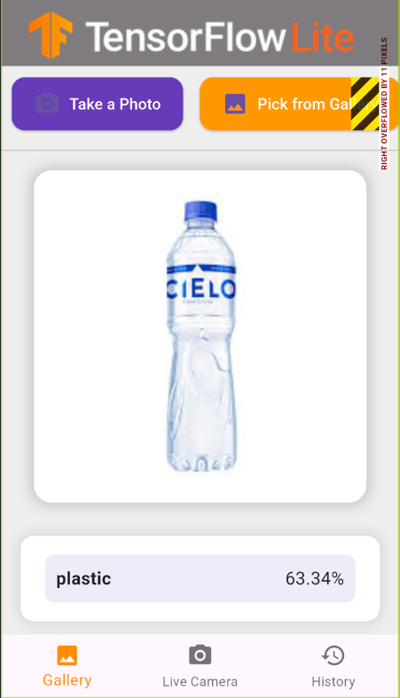
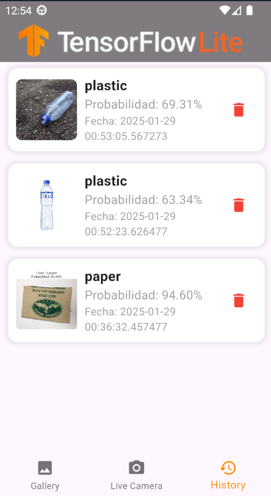

# Image Classification with MobileNet

This project is a **Flutter-based** application that performs **Image Classification** using **TensorFlow Lite**. It supports both **still images** and **live camera streams**, and now includes a **history feature** to review past analyzed images.

## 🚀 Features
- **📷 Still Image Classification**: Select an image from your gallery or capture a new photo for classification.
- **🎥 Live Camera Stream Classification**: Real-time object detection using your device's camera.
- **📜 History Storage**: Automatically saves analyzed images with their classification results.
- **🗑️ Delete History Items**: Remove previously analyzed images when no longer needed.
- **🔥 Optimized for Performance**: Uses TensorFlow Lite with background isolates for smooth inference.
- **♻️ Waste Classification**: Detects the type of waste and categorizes it into **Cardboard, Glass, Paper, or Plastic**.

## 🖥️ Supported Platforms
| Platform | File Support | Live Camera Support |
|----------|-------------|---------------------|
| ✅ Android | ✅ Yes | ✅ Yes |
| ✅ iOS | ✅ Yes | ✅ Yes |
| ✅ Linux | ✅ Yes | 🚧 Partial (see [issue](https://github.com/flutter/flutter/issues/41710)) |
| ✅ Mac | ✅ Yes | 🚧 Partial (see [issue](https://github.com/flutter/flutter/issues/41708)) |
| ✅ Windows | ✅ Yes | 🚧 Partial (see [issue](https://github.com/flutter/flutter/issues/41709)) |
| 🌐 Web | ❌ Not Supported | ❌ Not Supported |

## 📥 Download Model & Labels
Before building the project, you need to **download the MobileNet TensorFlow Lite model** and its corresponding labels. You can do this by running:
```bash
sh ./scripts/download_model.sh
```
This will download the necessary files into the `assets/models/` directory.

## 🛠️ Getting Started
1. **Install Flutter & Dependencies**:
   ```bash
   flutter pub get
   ```
2. **Run the App**:
   ```bash
   flutter run
   ```
3. **Select an image or use live classification mode.**

## 🔥 How It Works
### 📷 Still Image Mode
- Choose an image from your gallery **or** take a photo.
- The model will analyze and classify the object.
- The result is displayed **with the confidence score**.
- **Categorizes waste into:**
  - 🟤 **Cardboard**
  - 🟢 **Glass**
  - 📄 **Paper**
  - 🧴 **Plastic**



### 🎥 Live Stream Mode
- Enables real-time object classification.
- Uses camera frames to detect and label objects dynamically.
- Automatically categorizes the detected object into **Cardboard, Glass, Paper, or Plastic**.


### 📜 History Feature
- **Automatically saves analyzed images** with their classification results.
- **Stores the detected object name, confidence percentage, and timestamp**.
- **Delete unwanted entries** directly from the history screen.




